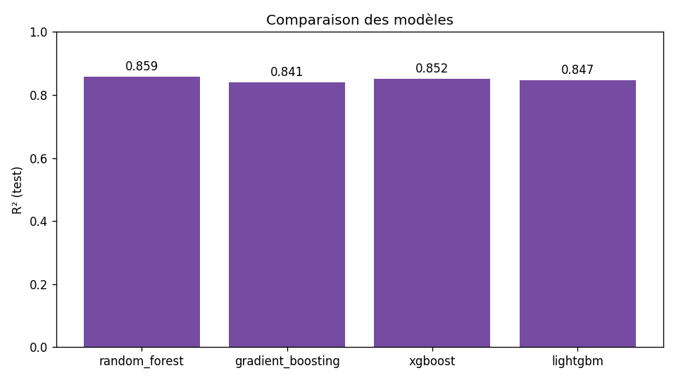
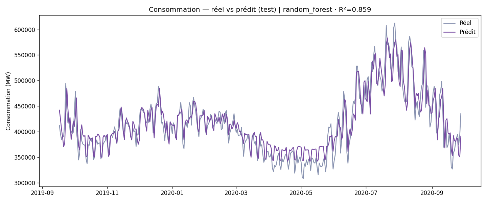

# ⚡ Prédiction de la demande énergétique quotidienne

Modèle de Machine Learning prédisant la **consommation électrique quotidienne** d'une ville à partir de la météo, du calendrier et de l'historique récent de consommation. Le projet couvre toute la chaîne : nettoyage des données, feature engineering, comparaison de modèles, évaluation rigoureuse et mise à disposition via une application web Flask.

## 🎯 Résultats

Évaluation sur un **découpage temporel** (80 % passé pour l'entraînement, 20 % futur pour le test) — c'est-à-dire dans des conditions réalistes de prévision, sans fuite de données.

| Modèle | R² (test) | RMSE | MAE |
|---|---|---|---|
| **Random Forest** ⭐ | **0.86** | 22 823 MW | 18 102 MW |
| XGBoost | 0.85 | 23 391 MW | 18 372 MW |
| LightGBM | 0.85 | 23 719 MW | 18 544 MW |
| Gradient Boosting | 0.84 | 24 208 MW | 19 184 MW |

> **Point clé — l'apport des variables autorégressives.** La consommation est fortement autocorrélée (corrélation de 0,90 avec la veille). En ajoutant des variables de *lag* (consommation de J-1, J-7) et des moyennes glissantes, le R² de test passe de **~0,53** (météo + calendrier seuls) à **0,86**. La variable la plus déterminante est de loin la consommation de la veille (**84 %** de l'importance).




## 🧠 Approche

1. **Reconstruction d'une série journalière propre** à partir des données brutes (agrégation par date, calendrier régulier, interpolation des jours manquants).
2. **Feature engineering** :
   - Météo : température, humidité, vitesse du vent, précipitations
   - Calendrier : mois, jour de la semaine, week-end, jour de l'année, événement spécial
   - **Autorégressif : lag J-1, lag J-7, moyennes glissantes 7 j et 30 j** (décalées d'au moins un jour → aucune fuite)
3. **Découpage temporel** (et non aléatoire) pour une évaluation honnête d'un problème de séries temporelles.
4. **Comparaison de 4 modèles** régularisés (Random Forest, Gradient Boosting, XGBoost, LightGBM), sélection du meilleur sur le R² de test.

## 📁 Structure

```
Prediction-Energetique/
├── data/
│   ├── raw/                 # Données brutes (cleaned_file.csv)
│   └── processed/           # Série journalière reconstruite (daily_series.csv)
├── models/                  # Meilleur modèle + métriques + importance des variables
├── results/                 # Visualisations (comparaison, prédictions, importances, EDA)
├── notebooks/               # Analyse exploratoire (energy_analysis.ipynb)
├── streamlit_app.py         # ⭐ Application web Streamlit (démo déployée)
├── src/
│   ├── train_model.py       # ⭐ Pipeline complet : features → entraînement → évaluation → sauvegarde
│   ├── app.py               # Version Flask équivalente
│   ├── data_module.py       # Préparation des données
│   ├── model_module.py      # Fonctions d'entraînement
│   ├── visualization_module.py
│   └── templates/           # Pages HTML de l'app
└── requirements.txt
```

## 🚀 Installation & utilisation

```bash
git clone https://github.com/2Alexis/Prediction-Energetique.git
cd Prediction-Energetique
pip install -r requirements.txt          # runtime (app)
# pip install -r requirements-dev.txt    # + entraînement (xgboost, lightgbm, matplotlib…)
```

**Entraîner le modèle** (régénère modèle, métriques et visualisations — nécessite `requirements-dev.txt`) :
```bash
python src/train_model.py
```

**Lancer l'application web (Streamlit)** :
```bash
streamlit run streamlit_app.py
```
L'application prédit la consommation à partir des paramètres météo/calendrier saisis ; les variables autorégressives sont automatiquement dérivées de l'historique le plus récent. Une version Flask équivalente est également disponible (`python src/app.py`).

## 🛠️ Stack technique

Python · pandas · scikit-learn · XGBoost · LightGBM · matplotlib · Streamlit · Flask · joblib

## 📊 Métriques d'évaluation

MSE · RMSE · MAE · R²

## 👤 Auteur

**Alexis Clerc** — Étudiant en Bachelor Informatique spécialisé IA & Data
[GitHub](https://github.com/2Alexis) · [Portfolio](https://alexis-clerc.fr)

## 📄 Licence

MIT
